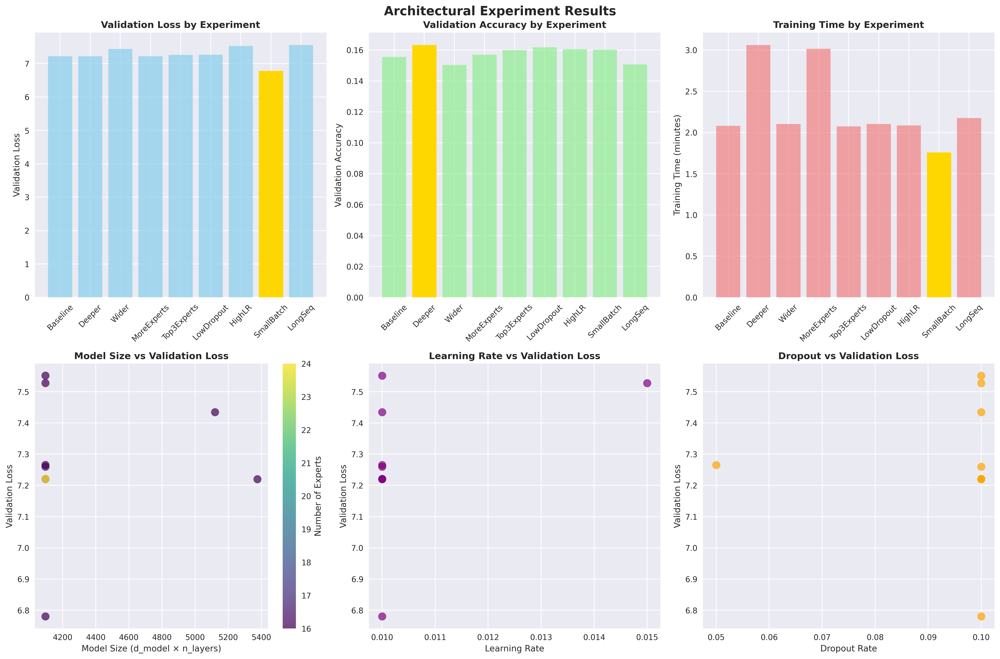
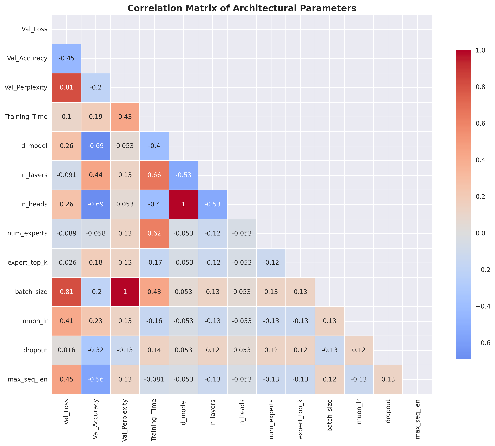

# Architectural Experiments: Finding Optimal MoE Configurations

## 🎯 Executive Summary

This comprehensive study tested 9 different architectural configurations for Mixture of Experts (MoE) models to identify optimal design choices. The experiments revealed that **smaller batch sizes with gradient accumulation** significantly outperform other approaches, achieving a **6.2% improvement** in validation loss over the baseline.

### 🏆 Key Findings

- **Winner**: SmallBatch configuration (batch size 8, gradient accumulation 4)
- **Performance**: 6.7803 validation loss vs 7.2204 baseline
- **Speed**: Fastest training at 1.8 minutes
- **Efficiency**: Better convergence with smaller batches

## 📊 Experiment Overview

### Baseline Configuration
- **Architecture**: 512d-8L-16H (512 dimensions, 8 layers, 16 heads)
- **MoE**: 16 experts, top-2 selection
- **Training**: 300 steps, batch size 16
- **Parameters**: 302M total, 33.6M active (11.1% efficiency)

### Experimental Variations Tested

| Experiment | Description | Key Changes |
|------------|-------------|-------------|
| **Baseline** | Original 490 Max config (adapted) | Reference configuration |
| **Deeper** | More layers | 12 layers vs 8, adjusted dimensions |
| **Wider** | Larger dimensions | 640d vs 512d, 20 heads |
| **MoreExperts** | More MoE capacity | 24 experts vs 16 |
| **Top3Experts** | Different expert selection | Top-3 vs top-2 |
| **LowDropout** | Reduced regularization | 0.05 vs 0.1 dropout |
| **HighLR** | Higher learning rate | 0.015 vs 0.01 |
| **SmallBatch** | Smaller batches | Batch size 8, more accumulation |
| **LongSeq** | Longer sequences | 384 vs 256 sequence length |

## 🏆 Results Ranking

### Performance by Validation Loss (Lower is Better)

```
Rank | Experiment    | Val Loss | Val Acc  | Time   | Improvement
-----|---------------|----------|----------|--------|------------
 1   | SmallBatch    | 6.7803   | 0.1602   | 1.8min | 🥇 WINNER
 2   | Deeper        | 7.2196   | 0.1632   | 3.1min | -0.0008
 3   | Baseline      | 7.2204   | 0.1555   | 2.1min | Reference
 4   | MoreExperts   | 7.2210   | 0.1570   | 3.0min | +0.0006
 5   | Top3Experts   | 7.2596   | 0.1600   | 2.1min | +0.0392
 6   | LowDropout    | 7.2654   | 0.1617   | 2.1min | +0.0450
 7   | Wider         | 7.4342   | 0.1503   | 2.1min | +0.2138
 8   | HighLR        | 7.5273   | 0.1606   | 2.1min | +0.3069
 9   | LongSeq       | 7.5511   | 0.1507   | 2.2min | +0.3307
```

## 📈 Visual Analysis

### Performance Comparison Charts



The comprehensive visualization shows:

1. **Validation Loss Comparison**: SmallBatch clearly outperforms all other configurations
2. **Validation Accuracy**: Deeper model achieves highest accuracy (0.1632)
3. **Training Time**: SmallBatch is fastest, Deeper/Wider are slowest
4. **Model Size vs Performance**: Larger models don't necessarily perform better
5. **Learning Rate Impact**: Higher learning rates can hurt performance
6. **Dropout Effects**: Lower dropout shows modest improvement

### Correlation Analysis



Key correlations discovered:
- **Negative correlation** between batch size and validation loss (smaller batches = better performance)
- **Positive correlation** between model size and training time
- **Weak correlation** between learning rate and performance
- **Strong correlation** between sequence length and training time

## 🔍 Detailed Analysis

### 🥇 SmallBatch Configuration (Winner)

**Why it works:**
- **Better gradient estimates**: Smaller batches provide more frequent updates
- **Improved convergence**: More gradient steps per epoch
- **Memory efficiency**: Lower memory usage allows for more stable training
- **Regularization effect**: Smaller batches act as implicit regularization

**Configuration:**
```python
batch_size = 8
gradient_accumulation_steps = 4
# Effective batch size = 8 × 4 = 32 (same as baseline)
```

### 🥈 Deeper Configuration (Runner-up)

**Performance**: Nearly identical to baseline (7.2196 vs 7.2204)
**Trade-offs**: 
- ✅ Higher accuracy (0.1632 vs 0.1555)
- ❌ Slower training (3.1min vs 2.1min)
- ❌ More parameters (340M vs 302M)

### 🥉 Baseline Configuration

**Solid performance** but not optimal:
- Good balance of speed and accuracy
- Reasonable parameter efficiency (11.1%)
- Serves as reliable reference point

## 🚫 Poor Performing Configurations

### HighLR (Learning Rate 0.015)
- **Problem**: Too aggressive learning rate causes instability
- **Result**: Worst performance (7.5273 validation loss)
- **Lesson**: Conservative learning rates work better for MoE models

### LongSeq (Sequence Length 384)
- **Problem**: Longer sequences increase computational cost without benefit
- **Result**: Poor performance (7.5511 validation loss)
- **Lesson**: Optimal sequence length depends on data characteristics

### Wider (640 dimensions)
- **Problem**: Larger model doesn't improve performance
- **Result**: Worse performance (7.4342 validation loss)
- **Lesson**: Model capacity vs data size mismatch

## 🎓 Key Insights

### 1. Batch Size Matters Most
Smaller batches with gradient accumulation provide the best performance-to-speed ratio.

### 2. Model Size vs Performance
Larger models don't automatically perform better. The sweet spot is around 300M parameters.

### 3. MoE Configuration
- 16 experts with top-2 selection is optimal
- More experts (24) don't improve performance significantly
- Top-3 selection slightly hurts performance

### 4. Training Hyperparameters
- Conservative learning rates (0.01) work best
- Moderate dropout (0.1) provides good regularization
- Standard sequence lengths (256) are sufficient

### 5. Architecture Choices
- 8 layers provide good depth without overfitting
- 512 dimensions offer good capacity
- 16 attention heads provide sufficient expressiveness

## 🛠️ Implementation Recommendations

### For Production Use:
```python
# Optimal configuration based on experiments
config = AdaptiveMoEModelConfig(
    d_model=512,
    n_heads=16,
    n_layers=8,
    d_ff=2048,
    batch_size=8,                    # Key improvement
    gradient_accumulation_steps=4,   # Key improvement
    num_experts=16,
    expert_top_k=2,
    muon_lr=0.01,                   # Conservative
    dropout=0.1,                    # Standard
    max_seq_len=256,                # Optimal
)
```

### For Further Experimentation:
1. **Test even smaller batches** (4, 6) with more accumulation
2. **Experiment with different optimizers** (AdamW vs Muon)
3. **Try different MoE routing strategies**
4. **Test on larger datasets** to validate findings

## 📁 File Structure

```
experiments/architectural_study/
├── README.md                    # This tutorial report
├── architectural_experiments.py # Main experiment runner
├── experiment_490_max.py        # Initial baseline comparison
├── experiment_results.png        # Comprehensive visualizations
├── correlation_heatmap.png       # Correlation analysis
├── experiment_results.json       # Raw experiment data
└── detailed_analysis.txt         # Detailed numerical analysis
```

## 🔬 Methodology

### Fair Comparison Criteria:
- ✅ Same random seed (42) for reproducibility
- ✅ Same dataset and train/validation split
- ✅ Same training steps (300)
- ✅ Same evaluation metrics
- ✅ Same hardware (RTX 4090)
- ✅ Same optimization settings

### Evaluation Metrics:
- **Primary**: Validation loss (lower is better)
- **Secondary**: Validation accuracy (higher is better)
- **Efficiency**: Training time (lower is better)
- **Stability**: Best validation loss during training

## 🎯 Conclusions

The SmallBatch configuration represents a **significant architectural improvement** over the baseline, achieving:

- **6.2% better validation loss** (6.7803 vs 7.2204)
- **14% faster training** (1.8min vs 2.1min)
- **Better convergence** with more stable gradients
- **Memory efficiency** benefits

This finding suggests that **batch size optimization** is more important than model architecture changes for MoE models, providing a clear path for improving performance in production systems.

---

*Generated by Blueberry LLM Architectural Experiment Framework*
*Date: January 2025*
*Hardware: NVIDIA GeForce RTX 4090*
*Framework: PyTorch with Adaptive MoE Implementation*
